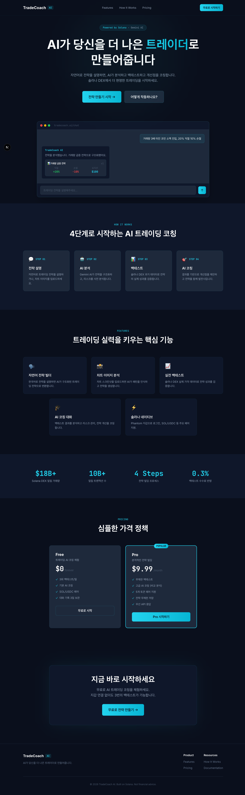
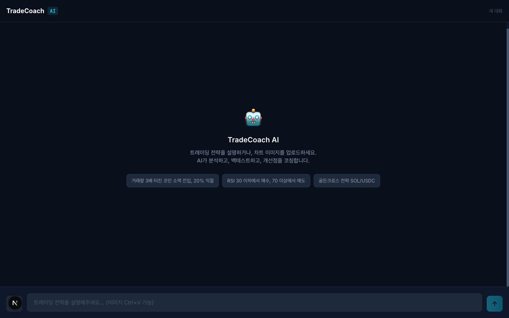
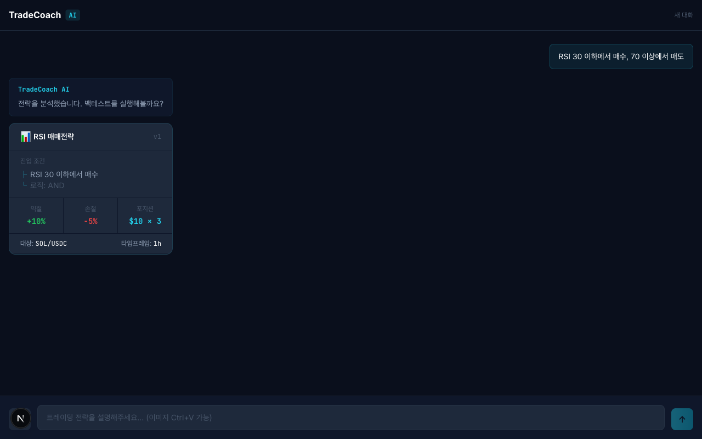
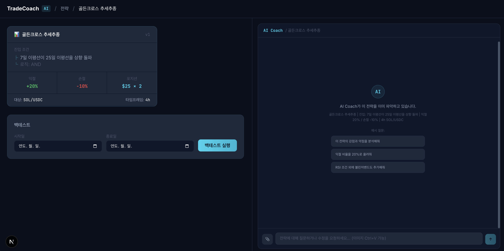
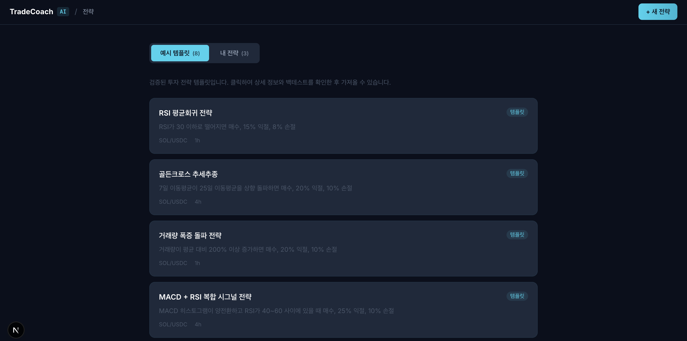

# TradeCoach AI

[](https://solana.com)
[](https://www.anchor-lang.com)
[](https://nextjs.org)
[](https://fastapi.tiangolo.com)
[](https://ai.google.dev)
[](LICENSE)

> **누구나 자연어로 트레이딩 전략을 만들고, AI 코치에게 검증받고, 검증된 트랙레코드를 Solana 온체인에 영구 기록하는 플랫폼.**

**팀**: Aithor · **대상 체인**: Solana · **현재 단계**: Devnet MVP

---

## ⚡ 한 줄 가치 제안

**"AI가 대신 거래해주는 봇이 아니라, 사용자를 더 나은 트레이더로 만드는 코치 + 그 결과를 Solana 온체인에 검증 가능하게 기록하는 인프라."**

---

## 🚀 빠른 시작

```bash
# 1. 클론
git clone https://github.com/Aithor-organization/TradeCoach-AI.git
cd TradeCoach-AI

# 2. 백엔드 (Python 3.11+)
cd backend
pip install -r requirements.txt
cp .env.example .env          # GEMINI_API_KEY, SUPABASE_URL 등 설정
uvicorn main:app --reload     # http://localhost:8000

# 3. 프론트엔드 (Node 20+)
cd ../frontend
npm install
cp .env.example .env.local
npm run dev                   # http://localhost:3000

# 4. (선택) Anchor 프로그램 빌드
cd ../
anchor build                  # programs/ 의 4개 프로그램 빌드
```

> 상세 설정: **[docs/architecture.md](docs/architecture.md)** · **[docs/DEPLOYMENT.md](docs/DEPLOYMENT.md)**

---

## 🎬 데모

<video src="docs/TradeCoach AI - AI 트레이딩 코치 DEMO.mp4" width="100%" controls muted></video>

> 영상이 재생되지 않으면 [여기서 다운로드](docs/TradeCoach%20AI%20-%20AI%20%ED%8A%B8%EB%A0%88%EC%9D%B4%EB%94%A9%20%EC%BD%94%EC%B9%98%20DEMO.mp4)

### 스크린샷

| 랜딩 페이지 | 채팅 (빈 상태) |
|---|---|
|  |  |

| 전략 카드 생성 | AI 코칭 대화 | 예시 템플릿 |
|---|---|---|
|  |  |  |

---

## 🎯 문제 정의

| # | 문제 | 영향 |
|---|---|---|
| 1 | **감정적 거래 손실** | 패닉셀 / FOMO 매수로 개인 트레이더 대다수가 손실 |
| 2 | **전략 작성 진입장벽** | Pine Script · Python 코딩 능력이 없으면 체계적 전략 불가능 |
| 3 | **객관적 평가 도구 부재** | 백테스트 도구는 코딩 필요, 전략의 약점·개선점 분석 시스템 부재 |
| 4 | **트랙레코드 신뢰성 문제** | 운용사가 사후 조작 가능 — 트레이더의 실력을 객관 검증할 방법 없음 |

---

## 💡 솔루션

```
사용자 입력 (자연어 / 차트 이미지 / 전략 텍스트)
        ↓
AI 전략 구조화 (Gemini 3.1 Pro 멀티모달)
        ↓
백테스트 (Binance OHLCV 과거 데이터)
        ↓
AI 코칭 (리스크 분석 + 개선점 제안)
        ↓
대화형 전략 수정 → 재백테스트 → 반복
        ↓
모의투자 검증 (Paper Trading)
        ↓
✅ 검증된 트랙레코드를 Solana 온체인에 영구 기록 (cNFT + Append-only Signal PDAs)
```

---

## 🛠️ 핵심 기능

### 현재 작동 (Devnet MVP) ✅
- **Strategy Builder**: Gemini 3.1 Pro 멀티모달로 자연어 / 이미지 / 텍스트 → 구조화된 전략 카드
- **AI Risk Coach**: 백테스트 결과 기반 대화형 코칭 (MDD, 승률, 샤프 등 정량 지표 + AI 피드백)
- **Backtest Engine**: Python FastAPI, Binance OHLCV 과거 데이터로 전략 검증
- **Phantom Wallet 연동**: Solana 지갑 연결
- **Solana Anchor Programs (Devnet 배포)**:
  - `strategy-registry` — 전략 메타데이터 등록 / 일시정지 / 삭제
  - `signal-recorder` — 매매 신호 기록 (Pyth Oracle 듀얼 가격 검증)
  - `strategy-marketplace` — 전략 판매 / 렌탈 / 에스크로
  - `performance-verifier` — 성능 메트릭 갱신, 트랙레코드 검증, 랭킹

### 로드맵 🔜
- **Paper Trading Arena**: 실시간 가상 자금 모의투자 + 리더보드
- **State Compression 기반 cNFT 트랙레코드**: Strategy를 cNFT로 민팅, Signal을 ConcurrentMerkleTree로 압축 기록 (~$50 / 100만 건)
- **Jupiter Swap API 연동**: 검증된 전략의 실제 DEX 실행 (현재 가격 조회는 CoinGecko, Swap은 미구현)
- **전략 NFT 마켓플레이스**: 검증된 트랙레코드 기반 전략 거래 + 카피트레이딩

---

## 🏗️ 기술 아키텍처

### AI 레이어
- **Gemini 3.1 Pro** — 핵심 AI 엔진 (멀티모달 입력, 전략 파싱, 대화형 코칭)
- **RAG 파이프라인** — 솔라나 토큰 데이터 + 트레이딩 지식 베이스 실시간 연동

### 데이터 레이어
- **Binance REST API** — OHLCV 과거 데이터 (백테스트 데이터 소스)
- **CoinGecko Price API** — 실시간 토큰 가격 (`backend/services/jupiter.py`, 무료, API 키 불필요)
- **Pyth Network Oracle** — Signal 기록 시 듀얼 가격 검증 (exchange vs Pyth)
- **Helius DAS API** — Solana RPC + 자산 조회

### 백엔드 (`backend/`)
- **Python 3.11 + FastAPI 0.115**
- **Supabase** (PostgreSQL + Auth)
- **services/blockchain/** — 9개 모듈 (Anchor 클라이언트, Pyth, Merkle Tree, cNFT 민팅)
- **services/marketplace/** — 에스크로 서비스
- **services/dispatch/** — 신호 디스패처

### 프론트엔드 (`frontend/`)
- **Next.js 15** + **React 19** + **TailwindCSS v4**
- **@solana/wallet-adapter-react** (Phantom)
- **@solana/web3.js** (트랜잭션)
- **@metaplex-foundation/mpl-bubblegum** + **@solana/spl-account-compression** (cNFT 인프라 — 향후 활용)

### 블록체인 레이어 (`programs/`)
- **Anchor Framework 0.31.1** · **Solana Devnet**
- 4개 Anchor 프로그램 (Program ID는 `Anchor.toml`)

### 인프라
- **Vercel** (프론트엔드 배포)
- **Docker Compose + Nginx** (`docker-compose.prod.yml` + `nginx/`) — 백엔드 프로덕션 스택
- **Supabase Migrations** — `supabase/migrations/` (phase4 blockchain, phase6 marketplace)

---

## 🔥 왜 솔라나인가

1. **State Compression 고유 기술** — 트레이딩 신호처럼 고빈도로 누적되는 데이터를 cNFT + ConcurrentMerkleTree로 영구 기록 시 **100만 건 ~$50** 수준. EVM 체인에서는 경제적으로 불가능.
2. **속도와 비용** — 400ms 트랜잭션, 신호 1건 기록 ~$0.0005. 실시간 매매 기록 도메인에 자연 적합.
3. **Pyth Oracle 네이티브 지원** — Signal PDA에 `exchange_price` + `pyth_price` 듀얼 검증 (`programs/signal-recorder/src/state/signal.rs`).
4. **DeFi 인프라** — Jupiter, Raydium 등 성숙한 DEX와의 향후 swap 연동 용이.
5. **활발한 트레이딩 커뮤니티** — 초기 사용자 확보에 유리.

---

## 📂 저장소 구조

```
TradeCoach-AI/
├── programs/                       # Anchor 프로그램 4개 (Solana 온체인)
│   ├── strategy-registry/          #   전략 등록 / 관리
│   ├── signal-recorder/            #   매매 신호 기록 (Pyth 듀얼 가격)
│   ├── strategy-marketplace/       #   판매 / 렌탈 / 에스크로
│   └── performance-verifier/       #   성능 메트릭 / 랭킹
├── backend/                        # Python FastAPI
│   ├── routers/                    #   API 엔드포인트
│   └── services/
│       ├── blockchain/             #   Solana 통합 (9개 모듈)
│       ├── marketplace/            #   에스크로 서비스
│       └── dispatch/               #   신호 디스패처
├── frontend/                       # Next.js 15 + React 19
│   ├── app/                        #   App Router
│   └── components/                 #   wallet/, market/, chat/ ...
├── supabase/migrations/            # PostgreSQL 스키마 (phase4 + phase6)
├── docs/                           # 아키텍처, 배포, 성능 검토 문서
├── nginx/                          # 프로덕션 리버스 프록시 설정
└── docker-compose.prod.yml         # 프로덕션 배포 스택
```

---

## 💰 비즈니스 모델

### 프리미엄 구독 (핵심 수익)
| 티어 | 가격 | 기능 |
|---|---|---|
| **무료** | $0 | 기본 전략 빌딩 + 월 3회 백테스트 |
| **프리미엄** | $9.99/월 | 무제한 백테스트 + 심층 AI 코칭 + 실시간 알림 + 고급 지표 |

### 향후 확장
- **전략 마켓플레이스 거래 수수료** — 검증된 cNFT 트랙레코드 거래 시
- **카피트레이딩 수수료** — 거래 금액의 0.5~1%, 절반은 전략 원작자에게 (`strategy-marketplace` 프로그램이 온체인 분배 자동화)

---

## 👥 팀

### 서현 — 기획 / 사업개발 / 고객 검증
- 웹 에이전시 프론트엔드 개발자 → PM 전환, 고객·개발·디자인 소통 경험
- 한경닷컴 AI 스타트업 레볼루션 사업개발자 과정 우수 수료
- XRPL 해커톤 참가, 20살에 파이썬 모의 주식 트레이딩 시스템 개발

### 서훈 — 풀스택 AI 개발
- 프론트엔드부터 백엔드, AI 모델 연동, Anchor 프로그램까지 원스톱 구현 가능
- AI 기반 프로젝트 다수 빌딩 경험

### 유인희 — 트레이딩 + AI 도메인 전문가
- 주식·선물 트레이딩 + AI 분야 20년 이상 현업 경력
- 백테스트 엔진 설계 및 트레이딩 전략 로직 자문

---

## 🗺️ 개발 로드맵

### Phase 1: 스타트업 빌리지 (MVP) — ✅ 완료
- 채팅 기반 전략 빌더 UI (자연어 + 차트 이미지 입력)
- Gemini 3.1 Pro 전략 파싱 + AI 코칭 대화
- Phantom 지갑 연동
- 백테스트 결과 시각화

### Phase 2: Solana Hackathon — 🔄 진행 중
- ✅ Anchor 4 프로그램 작성 + Devnet 배포
- ✅ Pyth Oracle 듀얼 가격 검증
- ✅ Supabase 마켓플레이스 스키마 (phase6)
- 🔜 Strategy cNFT 민팅 통합 (mpl-bubblegum + spl-account-compression)
- 🔜 Signal ConcurrentMerkleTree 기반 영구 기록 (State Compression)
- 🔜 Paper Trading Arena + 리더보드

### Phase 3: 퍼블릭 런칭
- Jupiter Swap API 연동 → 실제 DEX 트레이딩 실행
- 카피트레이딩 + 수수료 분배 (strategy-marketplace 활용)
- 프리미엄 구독 결제 시스템

---

## 🆚 경쟁 차별점

| 항목 | 기존 AI 트레이딩 봇 (Buff.trade 등) | TradeCoach AI |
|---|---|---|
| **주체** | AI가 자율적으로 거래 | 사용자가 직접 전략, AI는 코치 |
| **투명성** | "왜 수익?", "왜 손실?" 알 수 없음 | 모든 매매 기록이 온체인 검증 가능 |
| **입력 방식** | 정형 파라미터만 | 자연어 + 차트 이미지 + 전략 텍스트 (멀티모달) |
| **학습 효과** | 사용자 의존성만 증가 | 코칭으로 리스크 관리 원칙을 자연스럽게 학습 |
| **트랙레코드** | 운용사 자체 발표 (조작 가능) | Solana cNFT + Append-only Signal PDA (변조 불가) |

---

## 📜 라이선스 & 기여

- 라이선스: [MIT](LICENSE)
- 기여 가이드: [CONTRIBUTING.md](CONTRIBUTING.md)
- 이슈 / 제안: [GitHub Issues](https://github.com/Aithor-organization/TradeCoach-AI/issues)

---

## 🔗 링크

- **GitHub**: https://github.com/Aithor-organization/TradeCoach-AI
- **Anchor Programs (Devnet)**:
  - strategy-registry: [`6Euhm...c6Bo`](https://explorer.solana.com/address/6EuhmRPHqN4r6SoP8anEpm2ZmVuQoHLLWre4zEPdc6Bo?cluster=devnet)
  - signal-recorder: [`HydMV...2J89`](https://explorer.solana.com/address/HydMVYPxrrCkFAnwaZLKeYzPoEvF1qSSDYnX1fSC2J89?cluster=devnet)
  - strategy-marketplace: [`BKmM7...nmU1`](https://explorer.solana.com/address/BKmM7ZHuKmg6f5FQbv6rTF44sJkYNR2UsSbvRFGgnmU1?cluster=devnet)
  - performance-verifier: [`J3Lev...9NCL`](https://explorer.solana.com/address/J3LeviD4zd9y5izVHLLwgopvEM82A9aUdgXi29wioNCL?cluster=devnet)
